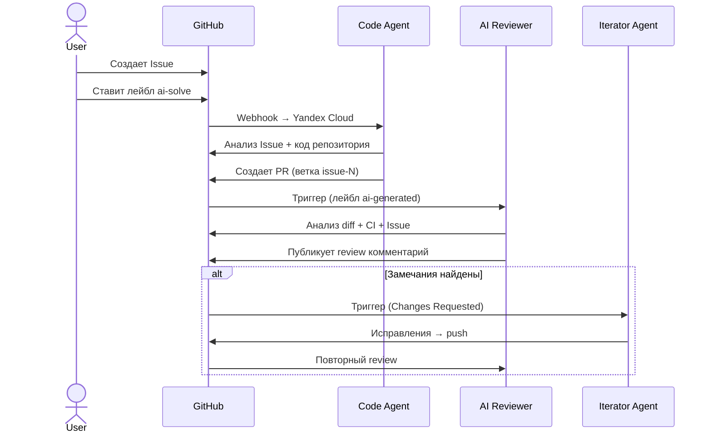

# Coding Agent

AI-агент для автоматизации полного цикла разработки (SDLC) в GitHub: решает Issues, создает Pull Requests, проводит code review и итеративно исправляет замечания.

## Как это работает

```
1. Пользователь создает Issue с описанием задачи
2. Ставит лейбл `ai-solve` → запускается Code Agent
3. Агент анализирует задачу, вносит изменения, создает Pull Request
4. PR получает лейбл `ai-generated` → запускается AI Reviewer
5. Reviewer анализирует diff, CI результаты и соответствие Issue
6. Если есть замечания → Code Agent исправляет (до 3 итераций)
7. Результат: проверенный PR с рабочим решением
```



## Быстрый старт

### Локальная установка

```bash
# Python 3.11+
pip install -e .
cp .env.example .env
# Заполнить .env (см. раздел Конфигурация)
```

### Docker

```bash
docker-compose up -d
```

Сервис поднимается на порту 8000 (webhook-сервер для GitHub App).

## CLI

```bash
# Решить Issue
coding-agent solve --repo owner/repo --issue 1

# Code review PR
coding-agent review --repo owner/repo --pr 1

# Итерация по фидбеку
coding-agent iterate --repo owner/repo --pr 1

# Локальное решение задачи (без GitHub)
coding-agent agentic-solve --task "описание задачи" --local -f file1.py

# Построить индекс кода
coding-agent index build --project . --no-llm

# Поиск по индексу
coding-agent index search --query "authentication"

# Webhook-сервер (GitHub App режим)
coding-agent serve --port 8000
```

## Конфигурация

### Переменные окружения (.env)

| Переменная | Описание | По умолчанию |
|---|---|---|
| `GITHUB_TOKEN` | GitHub personal access token | — |
| `LLM_API_KEY` | API-ключ LLM (OpenRouter/OpenAI) | — |
| `LLM_BASE_URL` | Base URL LLM API | `https://openrouter.ai/api/v1` |
| `LLM_MODEL` | Идентификатор модели | `openai/gpt-4o-mini` |
| `MAX_CONTEXT_FILES` | Макс. файлов для контекста | `10` |
| `MAX_FILE_SIZE_KB` | Макс. размер файла (КБ) | `50` |
| `MAX_ITERATIONS` | Макс. итераций исправлений | `3` |

### Конфигурация моделей (models.yaml)

Опциональный файл для переопределения моделей по агентам. См. `models.yaml.example`:

```yaml
default:
  model: openai/gpt-4.1-mini
  temperature: 0.2
  base_url: https://openrouter.ai/api/v1

agents:
  review:
    model: openai/gpt-4.1
    temperature: 0.1
  agentic:
    model: openai/gpt-4.1
    max_tokens: 16000
```

Допустимые имена агентов: `solve`, `review`, `iterate`, `agentic`, `indexer`.

## Деплой и инфраструктура

Агент работает на **Yandex Cloud** — Docker-контейнер деплоится на сервер и принимает события от GitHub через webhooks.

### Схема работы

1. В целевом репозитории устанавливается **GitHub App**
2. GitHub App отправляет webhook-события (issues, pull requests, comments) на сервер в Yandex Cloud
3. Webhook-сервер (`coding-agent serve`) обрабатывает события и запускает соответствующего агента

### Деплой

```bash
docker build -t coding-agent .
docker-compose up -d
```

Контейнер поднимает FastAPI-сервер на порту 8000, который принимает webhooks от GitHub App.

## Архитектура

```
src/coding_agent/
├── cli.py                 # Typer CLI — точка входа
├── config.py              # Pydantic Settings
├── server.py              # FastAPI webhook-сервер (GitHub App)
├── github_app.py          # GitHub App аутентификация (JWT)
├── ci_waiter.py           # Ожидание CI статуса
│
├── agents/                # Агентная логика
│   ├── agentic_agent.py   # ReAct цикл с tool-calling (до 30 шагов)
│   └── console_callback.py
│
├── services/              # Интеграции
│   ├── file_service.py    # Абстрактный интерфейс файловых операций
│   ├── github_service.py  # GitHub API (PyGithub)
│   ├── local_service.py   # Локальная файловая система
│   ├── llm_service.py     # OpenAI-совместимый клиент + retry
│   └── repo_manager.py    # Git операции (clone, branch, commit, push)
│
├── tools/                 # Инструменты агента
│   ├── __init__.py        # ToolRegistry → OpenAI function calling формат
│   ├── base_tools.py      # view_file, edit_file, create_file, list_directory, grep, find
│   └── indexer_tools.py   # Запросы к индексу кода
│
├── code_indexer/           # Навигация по коду (AST-граф)
│   ├── models.py          # CodeNode, Edge, ProjectGraph
│   ├── tools.py           # 6 функций запросов для агента
│   ├── summarizer.py      # LLM-суммаризация модулей
│   ├── graph/             # Построение и хранение графа
│   └── parser/            # Мультиязычный парсинг
│       ├── ast_parser.py        # Python (модуль ast)
│       ├── javascript_parser.py # JS/TS (tree-sitter)
│       ├── go_parser.py         # Go (tree-sitter)
│       └── rust_parser.py       # Rust (tree-sitter)
│
├── rag/                   # Семантический поиск (ChromaDB)
│   ├── indexer.py         # Построение векторного индекса
│   ├── chunker.py         # Разбиение кода на чанки
│   ├── embeddings.py      # Эмбеддинги (codestral-embed / text-embedding-3-small)
│   └── tools.py           # rag_search_code, rag_search_semantic, rag_search_hybrid
│
├── models/                # Pydantic-схемы данных
│   ├── schemas.py         # Issue, PR, CodeSolution, ReviewResult
│   └── agent_schemas.py   # AgentResult, ToolCall
│
└── prompts/               # Промпты агентов
    ├── prompt_layer.py
    └── templates/
        ├── agentic_system.txt
        └── reviewer_system.txt
```

### Основные компоненты

**Агенты** реализуют паттерн: получение контекста → построение промпта → вызов LLM → парсинг ответа → действие.

- **Code Agent** (`solve`) — читает Issue и файлы репозитория, генерирует решение, коммитит в ветку `issue-N`, создает PR
- **AI Reviewer** (`review`) — читает diff PR, CI статус и Issue, публикует развернутый review-комментарий
- **Iterator** (`iterate`) — читает замечания reviewer, вносит исправления, пушит в ту же ветку (до 3 циклов)
- **Agentic Agent** — мультишаговый ReAct-агент с tool-calling (до 30 шагов), использует инструменты навигации по коду

**Навигация по коду** — два подхода:
- **Code Indexer** — AST-граф проекта (узлы: MODULE, CLASS, FUNCTION, METHOD; связи: IMPORTS, CALLS, INHERITS, CONTAINS). Инкрементальное обновление по MD5-чексуммам
- **RAG** — семантический поиск через ChromaDB с code-specific эмбеддингами и smart chunking

**Сервисы** — `GitHubService` и `LocalService` реализуют общий `FileService` интерфейс. `LLMService` — OpenAI-совместимый клиент (OpenRouter по умолчанию) с retry (3 попытки, exponential backoff).

## Тестирование

```bash
pytest                          # все тесты
pytest tests/test_basic.py      # один файл
ruff check src tests            # линтер
ruff format src tests           # форматирование
mypy src                        # проверка типов
```

## Технологический стек

- **Python 3.11+**
- **LLM**: GPT-4o-mini / GPT-4.1 через OpenRouter (OpenAI-совместимый API)
- **GitHub**: PyGithub, GitHub App (webhooks)
- **CLI**: Typer + Rich
- **Webhook-сервер**: FastAPI + Uvicorn
- **Индексация кода**: tree-sitter (Python, JS/TS, Go, Rust)
- **Семантический поиск**: ChromaDB + llama-index
- **Качество кода**: ruff, black, mypy, pytest
